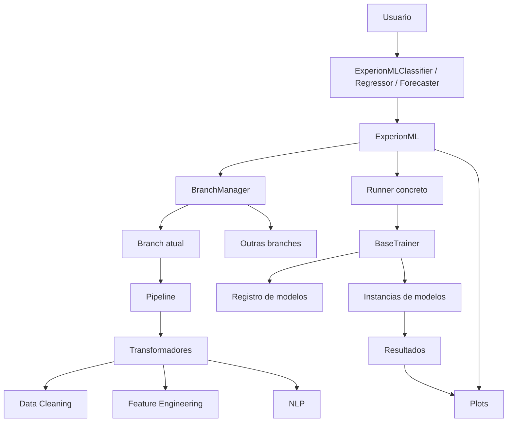

# Mapa Arquitetural do ExperionML

## Objetivo da biblioteca

O ExperionML é uma camada de orquestração para experimentação em machine learning.
Em vez de o usuário montar manualmente o fluxo de dados, pipeline, modelos,
avaliação e visualização, a biblioteca centraliza tudo em um único objeto de alto nível.

Em termos práticos, a biblioteca tenta resolver este problema:

- Receber um dataset.
- Aplicar pré-processamento em etapas encadeadas.
- Permitir múltiplos caminhos de experimento.
- Treinar vários modelos com o mesmo estado de dados.
- Comparar resultados e visualizar o que aconteceu.

## Ideia central da arquitetura

O projeto é organizado ao redor de uma classe principal chamada `ExperionML`, que atua como ponto de entrada da API e coordenador de quase todo o sistema.

Essa classe não faz tudo sozinha. Ela delega responsabilidades para cinco blocos principais:

1. Gerenciamento de dados e estado do experimento.
2. Pipeline de transformações.
3. Transformadores de limpeza, NLP e engenharia de atributos.
4. Runners e trainers para treinamento.
5. Modelos e visualizações.

## Visão de alto nível

## Componentes principais

### 1. API pública

Arquivo principal: `experionml/api.py`

Esse módulo expõe as classes que o usuário realmente instancia:

- `ExperionMLClassifier`
- `ExperionMLRegressor`
- `ExperionMLForecaster`
- `ExperionMLModel`

Essas classes são a fachada da biblioteca. O usuário não precisa conhecer todos os módulos internos para usar o framework.

### 2. Núcleo de orquestração

Arquivo principal: `experionml/experionml.py`

`ExperionML` é a classe-base abstrata que concentra:

- configuração do experimento
- inicialização dos dados
- gerenciamento de branches
- aplicação de transformadores
- despacho para runners de treino
- integração com plots
- propriedades utilitárias sobre dataset, métricas e modelos

Pense nela como o maestro do sistema.

### 3. Estado dos dados e branches

Arquivos principais:

- `experionml/data/branch.py`
- `experionml/data/branchmanager.py`

Uma `Branch` representa um estado isolado do experimento.
Ela guarda:

- dataset atual
- índices de treino e teste
- pipeline aplicado
- mapeamentos e atributos derivados

O `BranchManager` gerencia várias branches ao mesmo tempo.
Isso permite comparar pipelines diferentes sem sobrescrever o experimento anterior.

Exemplo mental:

- branch `main`: dados originais
- branch `scaled`: dados escalonados
- branch `balanced`: dados balanceados
- branch `selected`: dados com seleção de atributos

### 4. Pipeline

Arquivo principal: `experionml/pipeline.py`

O `Pipeline` herda da implementação do sklearn, mas adiciona comportamento extra importante:

- trabalha melhor com pandas
- aceita transformadores que alteram linhas
- aceita transformações só no conjunto de treino
- aceita transformações que atuam em `X` e `y`
- suporta melhor séries temporais
- usa cache com joblib

Ou seja: é uma extensão da ideia de pipeline do sklearn para o contexto específico do ExperionML.

### 5. Transformadores

Arquivos principais:

- `experionml/data_cleaning.py`
- `experionml/feature_engineering.py`
- `experionml/nlp.py`
- `experionml/basetransformer.py`

Os transformadores concretos fazem o trabalho de pré-processamento.
O que a classe `ExperionML` faz é padronizar como eles entram no pipeline.

O método `_add_transformer` é uma peça-chave da arquitetura porque ele:

- recebe o transformador
- injeta parâmetros globais do framework
- ajusta o transformador se necessário
- transforma os dados da branch atual
- atualiza o dataset da branch
- anexa o transformador ao pipeline

Isso unifica o comportamento de métodos como:

- `clean`
- `encode`
- `impute`
- `scale`
- `balance`
- `feature_generation`
- `feature_selection`

### 6. Runners e treinamento

Arquivos principais:

- `experionml/baserunner.py`
- `experionml/basetrainer.py`
- `experionml/training.py`

O fluxo de treino é dividido em camadas:

- `BaseRunner`: comportamento comum ligado a dados, branches, modelos e delegação dinâmica.
- `BaseTrainer`: lógica compartilhada de treinamento, tuning, bootstrap e montagem de resultados.
- `training.py`: implementações concretas dos modos de treino.

Os modos principais são:

- `Direct`
- `SuccessiveHalving`
- `TrainSizing`

O método `run` da classe principal não treina diretamente. Ele escolhe um runner concreto e delega o trabalho para ele.

### 7. Registro de modelos

Arquivo principal: `experionml/models/__init__.py`

Existe um registro central chamado `MODELS`.
Ele funciona como catálogo dos modelos disponíveis no framework.

Esse registro permite:

- escolher modelos por sigla
- validar compatibilidade com o tipo de tarefa
- instanciar classes dinamicamente
- compor ensembles e modelos customizados

Isso simplifica a API do usuário e isola a lógica de descoberta de modelos.

### 8. Tracking e logging

Arquivos principais:

- `experionml/basetracker.py`
- `experionml/basetransformer.py`

O framework incorpora tracking com mlflow, logging e configuração de execução em um mesmo conjunto de classes base.

Isso inclui:

- verbosidade
- warnings
- memória/cache
- backend paralelo
- engine de execução
- integração com mlflow

## Como o fluxo realmente acontece

### Fluxo de inicialização

1. O usuário instancia `ExperionMLClassifier`, `ExperionMLRegressor` ou `ExperionMLForecaster`.
2. A API concreta herda de `ExperionML`.
3. `ExperionML` cria a configuração interna de dados.
4. `ExperionML` cria um `BranchManager`.
5. Os dados são convertidos e anexados à branch atual.
6. O objeto passa a representar todo o estado do experimento.

### Fluxo de transformação

1. O usuário chama, por exemplo, `experionml.clean()`.
2. O método cria uma instância de `Cleaner`.
3. O núcleo chama `_add_transformer(cleaner, ...)`.
4. O transformador é ajustado e aplicado aos dados da branch atual.
5. O pipeline da branch recebe uma nova etapa.
6. O dataset transformado passa a ser o novo estado da branch.

### Fluxo de treinamento

1. O usuário chama `experionml.run(models=[...], metric=...)`.
2. `ExperionML` escolhe o runner correto conforme a tarefa.
3. `_run` injeta no runner a configuração e as branches atuais.
4. O runner chama `BaseTrainer._prepare_parameters()`.
5. O trainer resolve métricas, modelos, parâmetros e tuning.
6. O trainer executa o ciclo principal `_core_iteration()`.
7. Cada modelo é treinado, avaliado e opcionalmente submetido a tuning e bootstrap.
8. Os resultados retornam para a instância principal.

## Como os módulos se comunicam

O projeto usa comunicação por composição e herança.

### Herança

- `ExperionML` herda de `BaseRunner` e `ExperionMLPlot`.
- `BaseTrainer` herda de `BaseRunner` e `RunnerPlot`.
- Os runners concretos herdam de `BaseTrainer`.

### Composição

- `ExperionML` contém um `BranchManager`.
- Cada `Branch` contém um `Pipeline`.
- O `Pipeline` contém os transformadores.
- O `BaseTrainer` cria e mantém a coleção de modelos.

### Delegação dinâmica

`BaseRunner` tem um papel sofisticado aqui. Ele intercepta acesso a atributos e redireciona para:

- branch atual
- modelos
- colunas do dataset
- atributos do pandas

Isso faz com que a API pareça muito mais simples do que a estrutura real.

Exemplo conceitual:

- ao acessar `experionml.main`, você pode receber uma branch
- ao acessar `experionml.rf`, você pode receber um modelo
- ao acessar `experionml["idade"]`, você pode receber uma coluna

## Padrões de projeto identificáveis

### 1. Facade

Onde aparece:

- `experionml/api.py`
- `experionml/experionml.py`

Motivo:

O usuário interage com uma interface única e simples, enquanto a complexidade fica distribuída internamente.

### 2. Template Method

Onde aparece:

- `experionml/basetrainer.py`
- `experionml/training.py`

Motivo:

O esqueleto geral do treino fica na classe base, enquanto as variações concretas especializam o modo de execução.

### 3. Strategy

Onde aparece:

- métodos de transformação em `experionml/experionml.py`
- runners em `experionml/training.py`
- escolhas de modelos em `experionml/models/__init__.py`

Motivo:

O comportamento muda conforme a estratégia escolhida, sem mudar a interface pública.

### 4. Adapter

Onde aparece:

- `ExperionMLModel` em `experionml/api.py`
- adaptação de estimadores externos em `experionml/experionml.py`

Motivo:

O framework adapta objetos que seguem a API do sklearn para o contrato interno do projeto.

### 5. Registry

Onde aparece:

- `MODELS` em `experionml/models/__init__.py`

Motivo:

Há um registro central de modelos disponíveis, usado para descoberta e instanciação dinâmica.

### 6. Proxy ou Delegation Object

Onde aparece:

- `__getattr__`, `__getitem__`, `__setattr__` em `experionml/baserunner.py`

Motivo:

O objeto principal se comporta como um ponto de acesso indireto para várias estruturas internas.

### 7. Decorators para preocupações transversais

Onde aparece:

- `composed`
- `crash`
- `method_to_log`
- `available_if`

Motivo:

Esses decorators retiram logging, tratamento de erro e disponibilidade condicional da lógica principal dos métodos.

## O que faz esta arquitetura ser boa para demonstração

Para apresentação, o projeto tem algumas virtudes claras:

- API pública simples.
- Separação razoável entre estado, transformação e treino.
- Boa reutilização de infraestrutura comum.
- Extensibilidade para novos modelos e transformadores.
- Integração com ecossistema sklearn, pandas, mlflow e joblib.

## Limitações arquiteturais que vale comentar com honestidade

Se você quiser mostrar domínio real do projeto, vale mencionar também os trade-offs:

- Há bastante comportamento implícito por herança e delegação dinâmica.
- O objeto principal concentra muitas responsabilidades.
- O uso de `__getattr__` e acesso indireto aumenta ergonomia, mas dificulta leitura estática.
- A API é amigável ao usuário final, porém o custo é maior complexidade interna.

Isso não é necessariamente um defeito. É uma escolha de design voltada para produtividade de experimentação.

## Roteiro curto para apresentar em 5 minutos

### Slide 1

Problema que a biblioteca resolve:

"Como sair de dados brutos para comparação estruturada de múltiplos modelos sem transformar o notebook em um bloco enorme e difícil de manter?"

### Slide 2

Ideia principal:

"ExperionML encapsula dataset, pipeline, modelos, treino e análise em um único objeto orquestrador."

### Slide 3

Peças centrais:

- API pública
- ExperionML
- BranchManager e Branch
- Pipeline
- Transformadores
- BaseTrainer e runners
- Registro de modelos

### Slide 4

Fluxo de execução:

- inicializa dados
- cria branch
- aplica transformações
- registra pipeline
- escolhe runner
- treina modelos
- compara resultados
- gera plots

### Slide 5

Padrões de projeto:

- Facade
- Template Method
- Strategy
- Adapter
- Registry
- Delegation

## Roteiro curto para apresentar em 15 minutos

1. Explique a dor que a biblioteca resolve.
2. Mostre a API pública com `ExperionMLClassifier`.
3. Explique que o objeto contém o estado inteiro do experimento.
4. Mostre o conceito de branch.
5. Explique o pipeline como histórico executável de transformações.
6. Explique que o treino é delegado para runners.
7. Mostre que os modelos vêm de um registro central.
8. Feche com os padrões de projeto e os trade-offs.

## Frase final para apresentação

"O ExperionML não é só um conjunto de utilitários. Ele é um framework de experimentação que organiza dados, transformações, treinamento e análise em torno de um único objeto de orquestração, usando uma arquitetura baseada em fachada, estratégia, template method e gerenciamento explícito de estado por branches."
